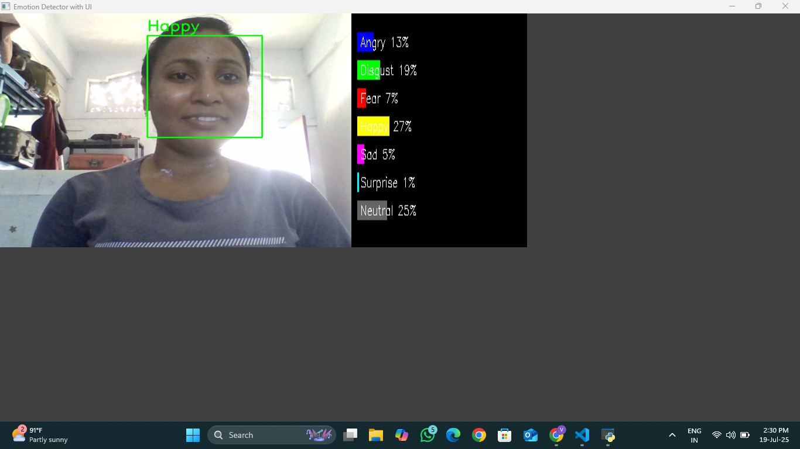

# 🎭 Emotion Detector using CNN

This project is an **Emotion Detection System** using a Convolutional Neural Network (CNN).  
It takes input from a webcam, detects faces using Haar Cascades, and classifies emotions using a pre-trained deep learning model.

---

## 🔍 Features

- Detects faces in real-time using OpenCV
- Classifies facial emotions:
  - 😠 Angry  
  - 🤢 Disgust  
  - 😨 Fear  
  - 😀 Happy  
  - 😢 Sad  
  - 😲 Surprise  
  - 😐 Neutral
- Real-time video stream from webcam
- Loads a pre-trained Keras model for accurate predictions

---

## 🧠 Model Details

- **Pre-trained Model:** `_mini_XCEPTION.102-0.66.hdf5`
- **Framework:** Keras (with TensorFlow backend)
- **Face Detection:** Haar Cascade Classifier (`haarcascade_frontalface_default.xml`)

---

## 🚀 Getting Started

### 🔧 Prerequisites

Make sure Python **3.10** is installed.

Install required libraries:

```bash
pip install keras tensorflow opencv-python numpy
```

---

## 📁 Project Structure

```
Emotion Detector/
├── Emotion_detector.py
├── _mini_XCEPTION.102-0.66.hdf5
└── haarcascade_frontalface_default.xml
```

---

## ▶️ How to Run

Run the following command in the terminal:

```bash
python Emotion_detector.py
```

🔌 **Make sure your webcam is connected**. The program will display a window showing real-time emotion predictions.

---

## 🛠 Tech Stack

- Python 3.10  
- Keras  
- TensorFlow  
- OpenCV  
- NumPy

---

## 📸 Demo

>


---

## 👩‍💻 Author

**Vasanthi Mada**  
B.Tech CSE, Rajiv Gandhi University of Knowledge and Technologies - Ongole  
[🔗 LinkedIn](https://www.linkedin.com/in/vasanthi-mada/) | [🐙 GitHub](https://github.com/VasanthiMada)

---


